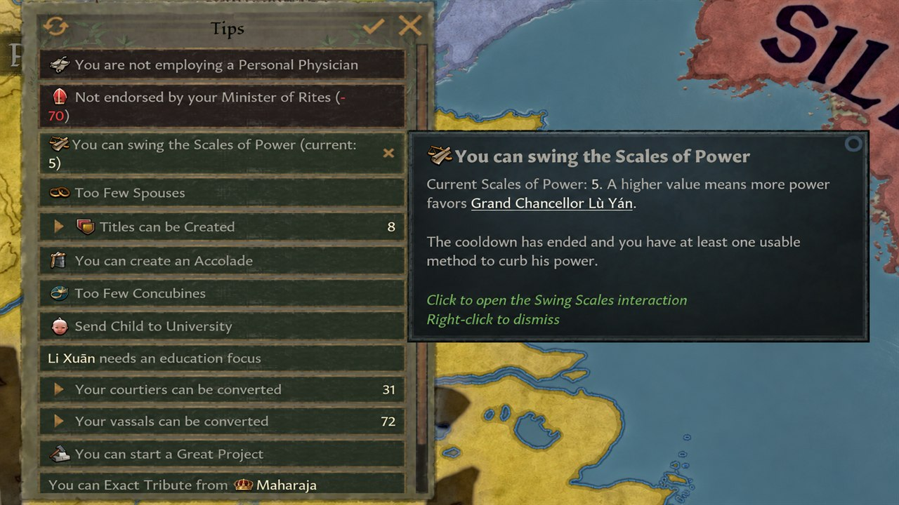
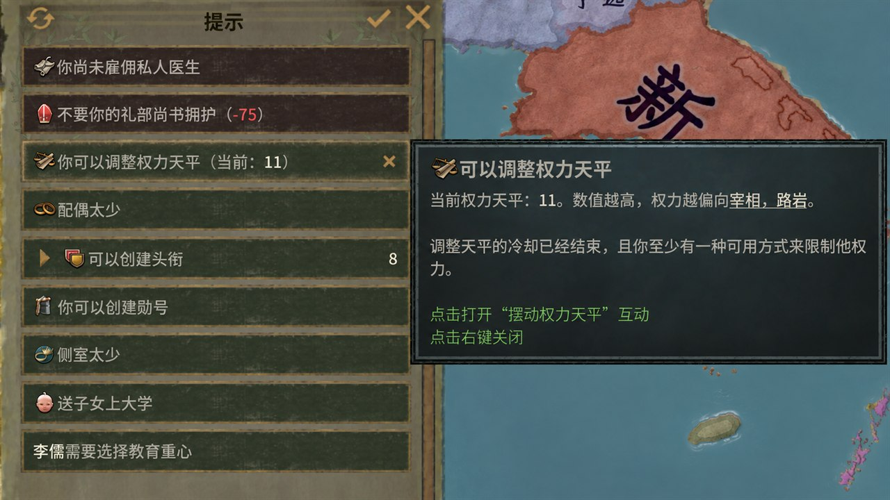

# Scales of Power Alert

A lightweight utility mod for Crusader Kings III 1.19.

[Steam Workshop](https://steamcommunity.com/sharedfiles/filedetails/?id=3803104291)

## Screenshots

| English | 简体中文 |
| :---: | :---: |
|  |  |

## Features

- Adds a ruler-side Important Action when **Swing the Scales of Power** is available.
- Supports any active power-sharing arrangement, including Celestial government.
- Shows the current Scales of Power value in the alert; higher values favor the diarch.
- Opens the Swing the Scales interaction when the alert is clicked.
- Avoids duplicating the base game's dangerous entrenched-regency alert.
- Supports all nine CK3 interface languages: English, French, German, Spanish, Russian, Polish, Japanese, Korean, and Simplified Chinese.

The base game already provides the corresponding reminder for the diarch. This mod fills in the missing general reminder for the ruler.

## Installation

Use the Crusader Kings III launcher to create a local mod, then copy `common`, `localization`, and `descriptor.mod` into its mod directory. Restart the game completely after installing or updating it.

## License

The original code and localization in this repository are available under the [MIT License](LICENSE). Crusader Kings III and its assets are owned by Paradox Interactive and are not covered by this license.

---

# 权力天平提示

适用于《十字军之王 III》1.19 的轻量工具 mod。

- 当君主可以“摆动权力天平”时显示“重要行动”提示。
- 支持所有启用权力分享的政体，包括天朝政体。
- 提示中显示当前权力天平数值；数值越高越偏向共治者。
- 点击提示直接打开“摆动权力天平”互动。
- 避免与本体针对危险牢固摄政的提示重复。
- 支持 CK3 的全部九种界面语言：英语、法语、德语、西班牙语、俄语、波兰语、日语、韩语和简体中文。

本体已经为共治者提供对应提示；本 mod 补充通常情况下缺失的君主侧提示。
